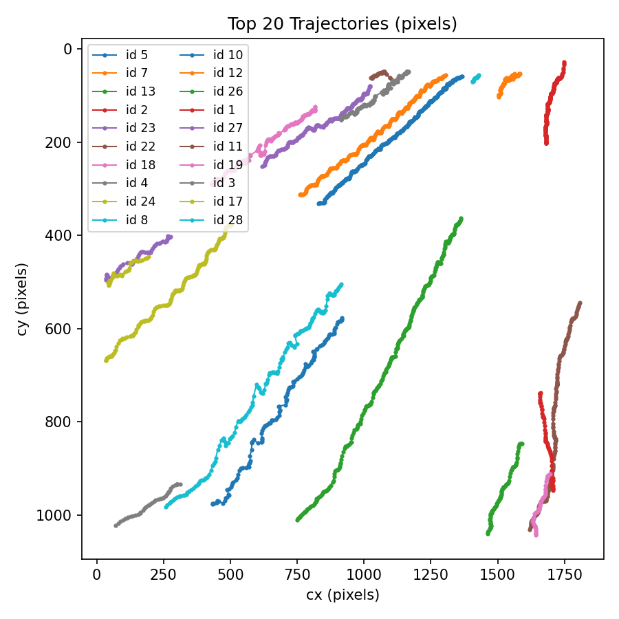

# SmartTrack Vision Suite

**SmartTrack Vision Suite** — Real-time object tracking + Advanced Analytics Dashboard (YOLOv8 + ByteTrack + Streamlit)  
**Includes: detector** → tracker → analytics pipeline, and a Streamlit dashboard for visual exploration.

  



## Quick highlights
- YOLOv8-based detection (detector in separate repo/package)
- ByteTrack-style tracking pipeline
- Analytics engine: counts, trajectories, fps, heatmaps, CSV/JSON outputs
- Streamlit dashboard for interactive inspection

## 🔥 Features

- 🚗 YOLOv8-based object detection  
- 🧭 ByteTrack-style multi-object tracking  
- 📈 Detailed analytics:  
  - object counts  
  - trajectories  
  - speeds  
  - heatmaps  
  - time-series graphs  
- 📊 Complete Streamlit dashboard  
- 🎥 Support for any MP4 input video  
- 📁 Auto-generated CSV/JSON stats  
- 🖼 Modular codebase for detectors, trackers, and analytics  

## 🛠 How It Works (Pipeline)
1. **Upload Video** via Streamlit UI  
2. **Detect Objects** using YOLOv8  
3. **Track Multiple IDs** using ByteTrack logic  
4. **Analyze Results**  
   - trajectories  
   - heatmaps  
   - speeds  
   - time-series  
   - CSV/JSON reports  
5. **Explore in Dashboard** with interactive graphs (Plotly)

## 📦 Installation

```bash
git clone https://github.com/Akshat-Jani/SmartTrack-Vision-Suite.git
cd SmartTrack-Vision-Suite

# Create environment (recommended)
python -m venv .venv
.\.venv\Scripts\activate       # Windows
```

## Install dependencies
```bash
pip install -r requirements.txt
```

## 🚀 Run the Streamlit Dashboard

```bash
streamlit run streamlit_app/streamlit_dashboard.py
```

## Project structure
```
SmartTrack-Vision_Suite/
├── src/
│ └── smarttrack/ # tracking + analytics Python modules
├── streamlit_app/ # Streamlit dashboard
├── scripts/ # helper scripts (optional)
├── configs/ # YOLO/ByteTrack configs
├── demos/ # demo videos/gifs
├── assets/ # images used in README
├── docs/ # project docs, explanation PDFs
├── requirements.txt
├── README.md
└── pyproject.toml
```
## ⚡ Performance & Reproducible Benchmark

**Measured** with the included `measure_stats.py` run (see `scripts/`) — reproducible numbers and the model SHA are recorded in `stats.json`. :contentReference[oaicite:13]{index=13}
```
| Metric | Value |
|---|---:|
| Device | `cuda`. :contentReference[oaicite:14]{index=14} |
| Input size | `640 × 640`. :contentReference[oaicite:15]{index=15} |
| Mean latency (ms) | **20.78**. :contentReference[oaicite:16]{index=16} |
| Median latency (ms) | **20.20**. :contentReference[oaicite:17]{index=17} |
| 95th percentile latency (ms) | **25.20**. :contentReference[oaicite:18]{index=18} |
| Inference-only FPS | **48.12**. :contentReference[oaicite:19]{index=19} |
| Model file size | **6.55 MB**. :contentReference[oaicite:20]{index=20} |
| Model SHA256 | `f59b3d833e2ff32...83b36`. :contentReference[oaicite:21]{index=21} |
| Peak memory (sampled RSS) | **~2.88 GB**. :contentReference[oaicite:22]{index=22} |
```
**Notes**
- “Inference-only FPS” means the detector forward pass measured in isolation, not including video I/O, pre/postprocessing, or tracker overhead. :contentReference[oaicite:23]{index=23}  
- For end-to-end real-time on video you should benchmark the full pipeline (detector + tracker + drawing + I/O). The Streamlit dashboard screenshots show the Analyzer/visualization capabilities; these are separate from the raw detection FPS.

## 📸 Gallery — Streamlit Dashboard & Analyzer

### Dashboard — Upload & Run


### Explore Runs — Summary & Time Series


### Detection Center Heatmap


### Interactive Time-series (FPS, counts)

